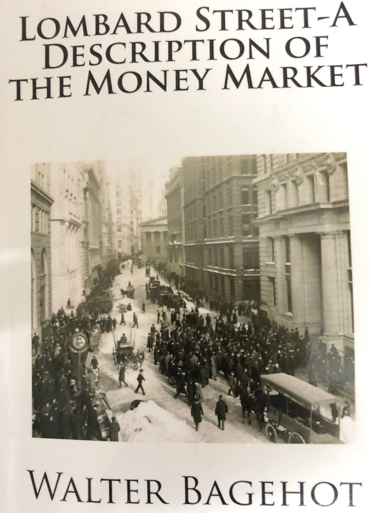

## Lombard Street - A Description of The Money Market
### By Walter Bagehot

#### Links:
- [Amazon Book Link](https://www.amazon.com/Lombard-Street-Description-Money-Market/dp/1481818295/)
- [Wikipedia](https://en.wikipedia.org/wiki/Lombard_Street:_A_Description_of_the_Money_Market)
- [Gutenberg (Full Text!)](http://www.gutenberg.org/ebooks/4359)

#### My Summary:
A wonderfully written seminal book in 1873 about the origins of Central Banking in England and the operation of the first well-developed money market in the world. Worth reading to learn about topics like the origins of banking, the messy evolution of banks themselves, the money flows across various actors in the money market, and the fragility of the banking system in even the most economically developed nation on earth at the time (late 19th Century England).

